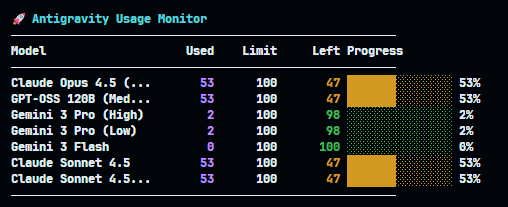

# Antigravity Usage Checker

🚀 Check your Antigravity AI usage quota from terminal


[](https://github.com/TungCorn/antigravity-usage-checker/actions/workflows/ci.yml)

## 🇬🇧 English

### Quick Install

**Windows (PowerShell):**
```powershell
iwr https://raw.githubusercontent.com/TungCorn/antigravity-usage-checker/main/install.ps1 -OutFile $env:TEMP\install.ps1; . $env:TEMP\install.ps1
```

**macOS / Linux (Bash):**
```bash
curl -fsSL https://raw.githubusercontent.com/TungCorn/antigravity-usage-checker/main/install.sh | bash
```

Then run:
```bash
agusage
```

### Manual Install

1. **Download** from [Releases](https://github.com/TungCorn/antigravity-usage-checker/releases/latest)
   - Windows: `antigravity-usage-checker-windows-amd64.zip`
   - macOS Intel: `antigravity-usage-checker-darwin-amd64.tar.gz`
   - macOS Apple Silicon: `antigravity-usage-checker-darwin-arm64.tar.gz`
   - Linux: `antigravity-usage-checker-linux-amd64.tar.gz`
2. Extract and run the binary
3. (Optional) Add to PATH

> ⚠️ Antigravity must be running

### Output



### Commands

```bash
agusage          # Show quota
agusage --json   # JSON output
agusage --help   # Help
```

### Platform Support

| Platform | Status |
|----------|--------|
| Windows | ✅ Fully tested |
| macOS | ✅ CI tested |
| Linux | ✅ CI tested |

---

## 🇻🇳 Tiếng Việt

### Cài đặt nhanh

**Windows (PowerShell):**
```powershell
iwr https://raw.githubusercontent.com/TungCorn/antigravity-usage-checker/main/install.ps1 -OutFile $env:TEMP\install.ps1; . $env:TEMP\install.ps1
```

**macOS / Linux (Bash):**
```bash
curl -fsSL https://raw.githubusercontent.com/TungCorn/antigravity-usage-checker/main/install.sh | bash
```

Sau đó chạy:
```bash
agusage
```

### Cài thủ công

1. **Tải** từ [Releases](https://github.com/TungCorn/antigravity-usage-checker/releases/latest)
   - Windows: `antigravity-usage-checker-windows-amd64.zip`
   - macOS Intel: `antigravity-usage-checker-darwin-amd64.tar.gz`
   - macOS Apple Silicon: `antigravity-usage-checker-darwin-arm64.tar.gz`
   - Linux: `antigravity-usage-checker-linux-amd64.tar.gz`
2. Giải nén và chạy binary
3. (Tùy chọn) Thêm vào PATH

> ⚠️ Antigravity phải đang chạy

### Kết quả


### Các lệnh

```bash
agusage          # Xem quota
agusage --json   # Xuất JSON
agusage --help   # Trợ giúp
```

### Hỗ trợ nền tảng

| Nền tảng | Trạng thái |
|----------|------------|
| Windows | ✅ Đã test đầy đủ |
| macOS | ✅ Đã test CI |
| Linux | ✅ Đã test CI |

---

## Development

### Run tests
```bash
go test ./... -v
```

### Build
```bash
go build -o agusage ./cmd/agusage/
```

---

## License

MIT © 2024

---

<p align="center">
  <b>If you find this useful, give it a ⭐!</b>
</p>
